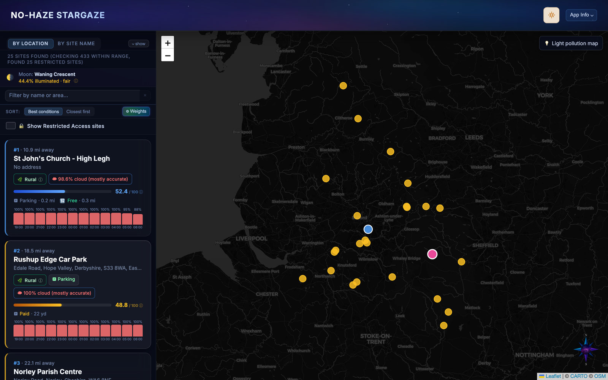
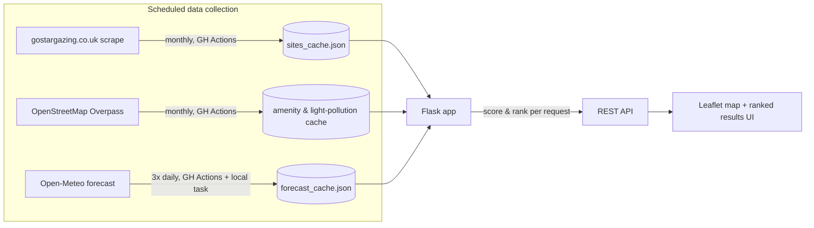

<div align="center">

# 🌌 No-Haze Stargaze

**Find the best stargazing spot in the UK, tonight.**

Combines a database of 2,600+ known dark-sky sites with real-time cloud-cover forecasts, local light-pollution detection, moon phase/rise/set, and site amenities — then scores and ranks every site for your exact location, date, and night window.

[](https://nohaze.co.uk)


<br>



</div>

<br>

## Contents

- [Engineering highlights](#engineering-highlights)
- [Features](#features)
- [How scoring works](#how-scoring-works)
- [Architecture & data pipeline](#architecture--data-pipeline)
- [Data sources](#data-sources)
- [Tech stack](#tech-stack)
- [Setup](#setup)
- [Usage](#usage)
- [Notes](#notes)

## Engineering highlights

A few things worth a closer look if you're skimming for engineering signal rather than features:

- **Dependency-free astronomy.** Sunrise/sunset/twilight boundaries and moonrise/moonset are computed from first principles (no `astral`/`ephem`/`skyfield`) — the Moon's position uses a truncated Meeus/Schlyter low-precision lunar theory, resolved to a horizon crossing with a coarse-scan-then-bisect solver. Validated against `pyephem` across 3 UK latitudes and 6 dates spanning a year, accurate to within ~9 minutes.
- **A real (if small) scoring/ranking system.** Every site gets a 0–100 score from a user-adjustable weighted blend of forecasted cloud cover, light pollution, and distance — with live re-ranking as weights change, and a separate weighting profile for nationwide search where distance isn't meaningful.
- **Multi-source data fusion.** Regional light-pollution ratings from one source get blended with live OpenStreetMap proximity queries (street lamps, lit roads) into a single adjusted score — a "Rural"-rated site next to a car park scores differently than one that's genuinely dark.
- **Scheduled data freshness, not live scraping per-request.** Forecasts refresh 3×/day via GitHub Actions (offset against a local Windows task covering the same cadence); site listings, amenities, and access-restriction flags re-sweep monthly. The Flask app serves entirely from cache, with a background file-watcher thread picking up updates without a restart.
- **Defensive UX for imperfect data.** Cloud-cover confidence is labelled per result based on forecast horizon; sites gostargazing.co.uk itself flags as restricted-access are detected and separated from open results rather than silently included or dropped.

## Features

**Search & discovery**
- Search by location (UK postcode or place name) or search directly by site name with autocomplete
- "Include all of UK" mode to search nationwide instead of a fixed radius
- Adjustable search radius (10–200 miles) with a distance slider
- Custom date picker and night-window (start/end hour) pickers, constrained to sunset–sunrise and to each other so Start and End always stay at least an hour apart
- Filter results by minimum light-pollution quality, and by confirmed on-site parking/toilets
- Sort by best overall conditions or by closest distance
- Free-text filter box to narrow the current results list by name or area

**Scoring & ranking**
- Every site is scored 0–100 from cloud cover, light pollution, and distance, combined into a ranked top-25 list
- Score weights are user-adjustable via a "Weights" panel (sliders that always sum to 100%), so you can prioritize, say, clear skies over travel distance
- A separate "Include all of UK" weighting drops distance entirely, since it's not meaningful at nationwide scale

**Light pollution, now including local street lighting**
- Each site carries a regional light-pollution rating (Dark site / Rural / Semi-rural / Suburban / Urban)
- That rating is blended with a local streetlight check: sites near OpenStreetMap-tagged street lamps or lit roads get a "Local light pollution expected" flag and a reduced score, on top of their regional rating
- The map card shows the distance to the nearest detected light source

**Restricted-access detection**
- Sites that gostargazing.co.uk itself marks as privately owned / requiring prior arrangement are automatically detected and excluded from the default results
- A "Show Restricted Access sites" checkbox merges them back into the ranked list (at their correct scored position) if you still want to see them, e.g. to arrange a visit
- A second, lower-confidence "likely restricted" tier catches looser wording (mostly observatories and astronomical societies) — these stay visible in the normal results with a warning chip rather than being filtered

**Moon phase, rise & set**
- Current moon phase, illumination percentage, and a stargazing-quality descriptor (excellent → very poor) are shown for the selected night
- Moonrise/moonset times are shown alongside sunrise/sunset, and the darkness-through-the-night bar flags exactly which stretches are moonlit — since the sky isn't fully dark while a bright moon is up, even during "full darkness" by twilight-angle alone

**Amenities**
- Parking and toilet availability, sourced two ways: a yes/no signal from each site's own gostargazing.co.uk listing (used for the parking/toilet filters), and nearest-distance lookups against OpenStreetMap for on-map display
- A "Directions" link and a link through to the site's full gostargazing.co.uk page

**Map & UI**
- Interactive Leaflet.js map with colour-coded, score-ranked markers alongside the results list
- Light and dark theme toggle
- Fully responsive mobile layout, including touch-friendly custom dropdowns, tap-to-open tooltips, and a compact results header

## How scoring works

Each site gets a 0–100 score from a weighted blend of:

| Component | Default weight | What it measures |
|---|---|---|
| Cloud cover | 38% | Forecast cloud cover during your chosen night window (lower is better) |
| Light pollution | 37% | 75% regional light-pollution rating + 25% local street-lighting proximity |
| Distance | 25% | How far the site is from your search location |

When "Include all of UK" is active, distance is dropped and the remaining two are reweighted to roughly 51% cloud / 49% pollution. All weights are adjustable from the Weights panel in the app.

Moon illumination is calculated and displayed for context but isn't currently part of the score itself.

## Architecture & data pipeline



The Flask app never scrapes or hits the weather API synchronously on a user request — everything it serves comes from a local JSON cache kept warm by scheduled jobs, so a search is just geocode → filter → score → rank against in-memory data. A background thread watches `forecast_cache.json` for changes and reloads it without restarting the process.

## Data sources

| Source | Data | How it's used |
|---|---|---|
| [gostargazing.co.uk](https://gostargazing.co.uk) | Site name, address, coordinates, regional light-pollution rating, site type, on-site parking/toilet listings, and access-restriction notices | The core site database and the parking/toilet filter checkboxes |
| [Open-Meteo](https://open-meteo.com) | Hourly cloud cover forecast | Cloud cover scoring and the per-hour forecast chart on each site card |
| [OpenStreetMap](https://www.openstreetmap.org) (via the Overpass API) | Street lamps, lit roads, parking areas, and toilets near each site | Local light-pollution detection and on-map amenity distances |
| [postcodes.io](https://postcodes.io) | UK postcode geocoding | Turning a postcode search into a map location |
| [Nominatim](https://nominatim.openstreetmap.org) (OpenStreetMap) | Place name geocoding (Great Britain & Ireland) | Turning a town/city search into a map location |
| [CARTO](https://carto.com/basemaps) | Basemap tiles | The map background |

Sun/twilight times and lunar phase/illumination/rise/set are all calculated locally (no external API) from date, time, and coordinates.

## Tech stack

- **Backend:** Python, Flask, served with Gunicorn
- **Frontend:** Vanilla HTML/CSS/JavaScript (no framework), Leaflet.js for the map
- **Automation:** GitHub Actions (scheduled scraping and forecast refresh)
- **Deployment:** [Render](https://render.com) (auto-deploys from `main`)

## Setup

```bash
# 1. Create a virtual environment (optional but recommended)
python -m venv .venv && source .venv/bin/activate

# 2. Install dependencies
pip install -r requirements.txt

# 3. Run the app
python app.py
```

Then open **http://localhost:5003** in your browser.

## Usage

1. Enter your **location** (UK postcode or town name, e.g. `M1 1AE` or `Edinburgh`) — or switch to **By Site Name** to look up a specific site directly
2. Select a **date** and **night window**
3. Set your **max travel distance**, or check **Include all of UK** to search nationwide
4. Optionally filter by **minimum light-pollution quality**, **parking**, or **toilets**
5. Click **Find Best Sites**

Results appear as a ranked list and colour-coded pins on the map. Click any site for its full breakdown, or use the **Weights** button to customise how much cloud cover, light pollution, and distance each count toward the score.

## Notes

- The app is for personal, educational use only.
- Cloud cover is a forecast; actual conditions may differ, and forecasts further into the future are less reliable (the app labels each result's forecast confidence accordingly).
- Sites without usable coordinates on their gostargazing.co.uk page are excluded from the database.
- Amenity, street-lighting, and restricted-access data reflect what's currently available from OpenStreetMap and gostargazing.co.uk and may be incomplete for some sites.
